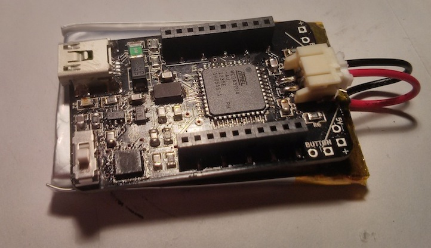

hadokenIMU
----------

hadokenIMU is an Arduino Leonardo compatible 9DoF inertial measurement unit (IMU) with integrated LiPo battery charger and XBee-style radio connector. The name was chosen because these boards are an integrated design for gesture recognition gloves for Super Street Fire: live action Street Fighter 2 in a ring of fire.

### Feature Summary

* Arduino Leonardo compatible
* Programmable via Mini USB jack or 6-pin ICSP header using pogo pins
* Wireless support with [RN-XV WiFly](http://rovingnetworks.com/products/RN171XV), Bluetooth Bee, or compatible radio
* Uses an [Invensense MPU-9150](http://www.invensense.com/mems/gyro/mpu9150.html) 9DoF sensor for 3-axis accelerometer, gyroscope, and magnetometer data over I2C
* Battery power provided through a 2-pin JST header
* LiPo charging circuitry integrated - charge off USB connection
* Optional button connector for output trigger
* 1.15" x 1.8" - slightly smaller than a 1000mAh LiPo battery

### Documents

* [Schematic](docs/hadokenIMU-schematic.pdf)
* [Bill of Materials](docs/hadokenIMU-BOM.csv)